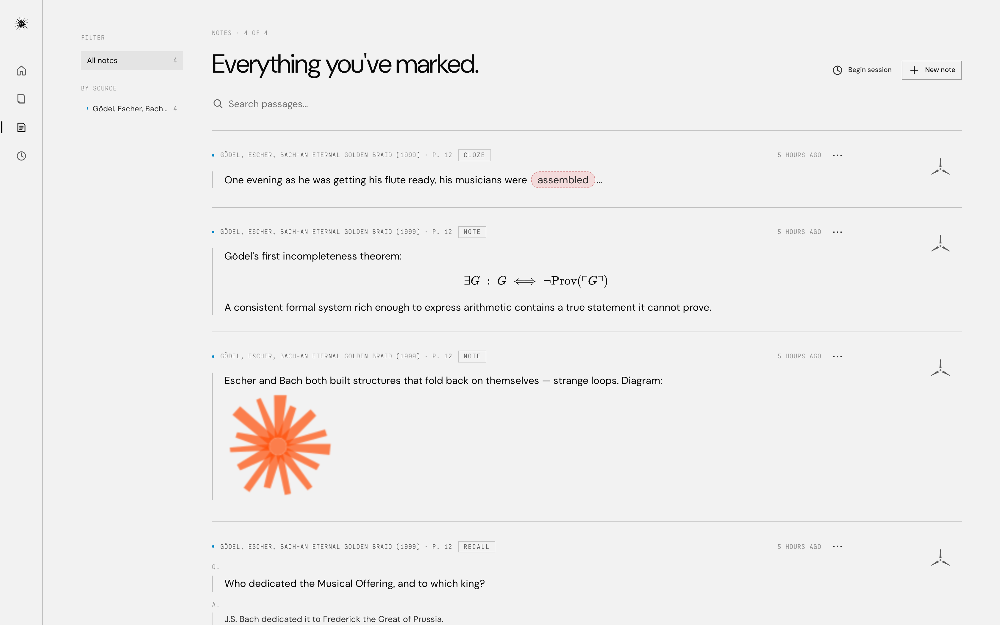
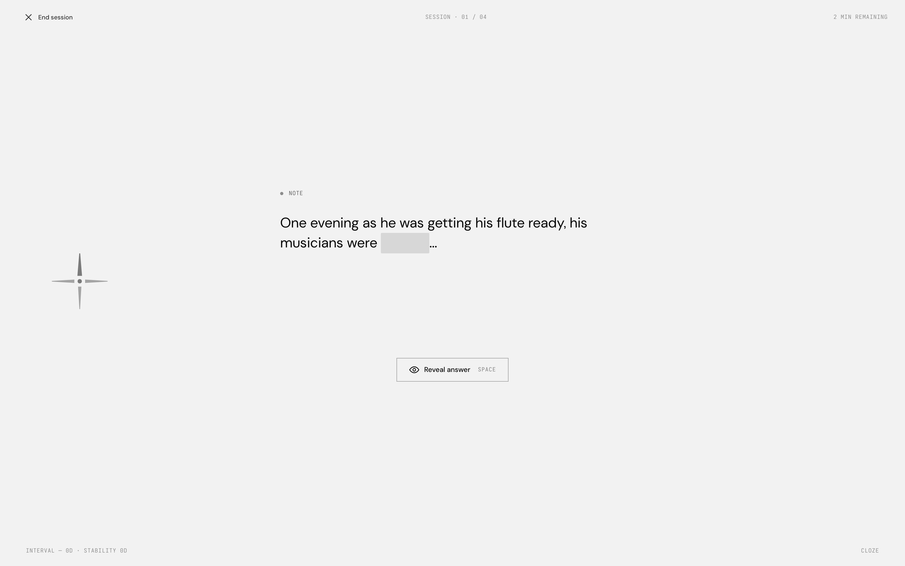

# Odyssey

Odyssey is a PDF reader with spaced repetition built in. Annotations become FSRS-scheduled review cards.

Reading and remembering usually live in separate apps: PDFs in Preview, notes in Notion, flashcards in Anki. Odyssey is one place for all three.


## Features

- Annotations are cards. No separate authoring step.
- Cloze deletions with `[[double brackets]]`. Multiple blanks on one card reveal and grade together.
- Images, diagrams, and LaTeX render inline in card bodies.
- FSRS scheduling instead of SM-2. Fewer reviews for the same retention than Anki.
- Local-first. PDFs, annotations, and review history stay on the machine. No account, no sync.

Available as a web app or a native macOS app. Both talk to the same local server.





## Run it

```bash
cp .env.example .env
podman compose up -d --build
```

Web UI at `http://localhost:3000`, API at `http://localhost:8000`. For the native Mac app: `swift run` inside `apps/mac/OdysseyMacApp/`.

Optional: set `GEMINI_API_KEY` in `.env` to have uploads auto-extract title / author / excerpt (free-tier Gemini). Restart the api service with `podman compose up -d api` after editing `.env`.

Local dev without containers: see `apps/api/README.md` and `apps/webapp/README.md`.

## Credits

Inspired by [Andy Matuschak](https://andymatuschak.org/)'s [Orbit](https://github.com/andymatuschak/orbit) and the mnemonic medium. FSRS by [open-spaced-repetition](https://github.com/open-spaced-repetition).
